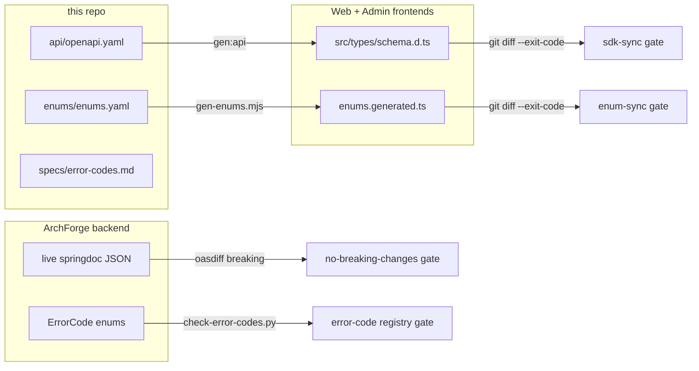

# ArchForgeSpec

[](https://github.com/sofn/ArchForgeSpec/actions/workflows/ci.yml)
[](./LICENSE)

**The constitution an AI agent reads first.** Contracts, architecture, and AI context for the ArchForge multi-repo project — not application code.

This repository is the source of truth for:

- the five-repo map (`repos.yaml`, `architecture.md`)
- the public API contract (`api/openapi.yaml`)
- shared enumerations (`enums/enums.yaml`)
- cross-repo specs (`specs/`)
- agent skills (`skills/`)

Clone it next to `ArchForge`, `ArchForgeAdmin`, `ArchForgeWeb`, and `ArchForgeDocs`.

Docs: [https://archforge.lesofn.com](https://archforge.lesofn.com) · [中文](./README.zh-CN.md)

## Quick map

```
archforge/
├── ArchForge/          # backend: server-admin :8080 + server-web :8081
├── ArchForgeAdmin/     # admin UI (Vue) — :8848 → server-admin
├── ArchForgeWeb/       # C-end Next.js — :3000 → server-web
├── ArchForgeDocs/      # VitePress site
└── ArchForgeSpec/      # this repo
```

Start here:

| Need | File |
|------|------|
| Machine-readable repo/module map | [`repos.yaml`](repos.yaml) |
| Human architecture + ports | [`architecture.md`](architecture.md) |
| HTTP contract | [`api/openapi.yaml`](api/openapi.yaml) |
| Shared enums | [`enums/enums.yaml`](enums/enums.yaml) |
| Specs index | [`specs/api-path.md`](specs/api-path.md), [`specs/security.md`](specs/security.md), [`specs/enum-sync.md`](specs/enum-sync.md) |
| Agent skills | [`skills/index.yaml`](skills/index.yaml) |

## How the contract flows

Every arrow below ends in a CI gate — implementations cannot drift from this repo unnoticed:



Change flow: **edit this repo first**, then make the implementation follow. To touch an endpoint: update `openapi.yaml`, implement it, export the live springdoc JSON (`OpenApiSnapshotTest`), and let `oasdiff` prove existing consumers see no breaking change. Shared enums follow `Java enum → enums.yaml → generated TS` (see [`specs/enum-sync.md`](specs/enum-sync.md)).

## Ports

| Process | Port |
|---------|------|
| `archforge-server-admin` | 8080 |
| `archforge-server-web` | 8081 |
| ArchForgeAdmin (Vite) | 8848 |
| ArchForgeWeb (Next.js) | 3000 |

## Rules

1. If an API, enum, or path does not fit a client, change this repo first.
2. Do not invent deleted endpoints. `/system/menu` and `/system/role` are **not** in the contract.
3. Backend coding standard stays next to backend code. This repo only [points to it](specs/backend-standard.md).
4. Never introduce Git submodules.

## License

MIT
