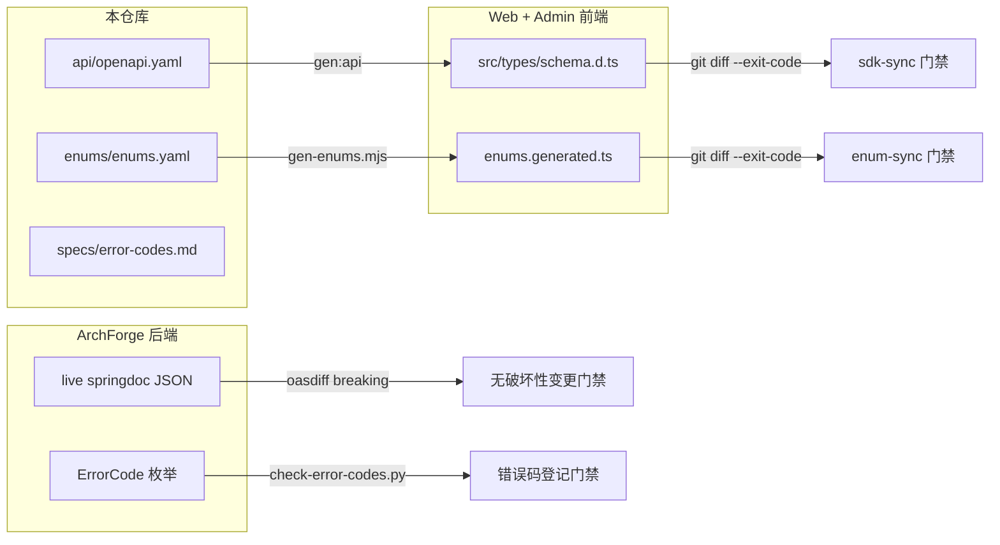

# ArchForgeSpec

[English](./README.md) | 中文

**给 AI Agent 读的项目宪法。** ArchForge 五仓的契约、架构与 AI 上下文——不含业务代码。

本仓库是以下内容的事实源：

- 五仓地图（`repos.yaml`、`architecture.md`）
- HTTP 契约（`api/openapi.yaml`）
- 共享枚举（`enums/enums.yaml`）
- 跨仓规范（`specs/`）
- Agent skills（`skills/`）

请与 `ArchForge`、`ArchForgeAdmin`、`ArchForgeWeb`、`ArchForgeDocs` 并列克隆。

文档：[https://archforge.lesofn.com](https://archforge.lesofn.com)

## 契约如何流动

下面每条箭头的终点都是一个 CI 门禁 —— 各仓实现无法在不知不觉中偏离本仓库：

变更流程：**先改本仓库**，再让实现跟上。修改接口：更新 `openapi.yaml` → 实现它 → 导出 live springdoc JSON（`OpenApiSnapshotTest`）→ 让 `oasdiff` 证明既有消费方零破坏。共享枚举走 `Java enum → enums.yaml → 生成 TS`（见 [`specs/enum-sync.md`](specs/enum-sync.md)）。

## 端口

| 进程 | 端口 |
|------|------|
| `archforge-server-admin` | 8080 |
| `archforge-server-web` | 8081 |
| ArchForgeAdmin（Vite） | 8848 |
| ArchForgeWeb（Next.js） | 3000 |

## 规则

1. API / 枚举 / 路径对不上客户端时，先改本仓。
2. 不要发明已删除端点。`/system/menu` 和 `/system/role` **不在契约里**。
3. 后端编码规范在后端仓。本仓只 [指向它](specs/backend-standard.md)。
4. 永远不要引入 Git submodule。

## License

MIT
